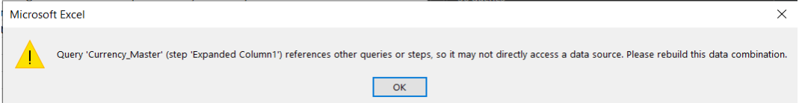

# Overview
This README provides information on how to extract RedHat Cost Management data into one or more Microsoft Excel files and present in Microsoft Power BI. Excel uses Cost Management REST APIs to extract, transform and load the data. 
Power BI Report uses the excel files to visualize the data in the designed format. The Power BI desktop file can be published to Power BI Service for further distribution based on available access levels.

# Architecture
To better understand this read over our architecture [document](./design/README.MD).

# Basic Setup
## console.redhat.com Authentication Setup

1. The user should have access to Cost Management application using UI credentials. 
2. The user should have service accounts and asscoiated client credentials defined. 

## Microsoft Excel Setup
1. The user should have access to a Windows machine with Microsoft Excel 2016 or later installed. 
2. Ensure Excel has the "**Data**" ribbon with option "**Queries & Connections**" available underneath. If the options are not available, navigate to File, Options, Customize Ribbon to add the option. 
3. Navigate to "**Data --> Get Data --> Launch Power Query Editor**". This should open the Power Query window. On the left side of the screen, expand on "**Queries**". The confirms that Power Query is available.

**_Note: The navigation steps might differ depending on the Excel version being used. The goal is to ensure that data queries & conections are accessible and can be reviewed through Power Query if required._**

## Microsoft Power BI Setup
1. Ensure user has the latest version of Power BI Desktop installed on the Windows machine. It can be downloaded from [Microsoft](https://www.microsoft.com/en-us/download/details.aspx?id=58494) site. 
2. Ensure Power BI Service is accessible if the report needs to be published to the service. The service can be accessed at https://app.powerbi.com/

#  Data Load

## Load Cost Management into Hello.xlsx
### Download & Setup
1. Download the samples's latest [release](https://github.com/project-koku/cost-mgmt-powerbi-sample/releases/latest). 
1. Unzip the file.
1. Copy the file "**auth.csv.sample**" to "**data**" directory and rename it the file to "**auth.csv**". Replace the text "CHANGE THIS TO CLIENT_ID" & "CHANGE THIS TO CLIENT_SECRET" with the the service account client id and client secret respectively. Ensure both the values are segreagated by a comma. Save and close the file.
1. Locate and open the `data/Hello.xlsx` file for the test sample. Execute the below steps to ensure sucessfull connectivity to basic Cost Management REST APIs using the Hellow.xlsx before executing more advanced data extractions.

### Load Data
1. Navigate to **Data --> Queries & Connections**. This should list the queries on the right side of the window. 
1. Navigate to **Data --> Get Data --> Data Source Settings...**. This should open the settings window. Select the path of the auth.csv file and click on the button **Change Source**. Update the **File Path** with the path for the auth.csv. 

**_Note:The auth.csv file can be moved to other folders of choice but the file path should be updated in the Data source settings._**
1. Navigate to the Data Period sheet. Update the Start and End dates as needed ensuring the guidelines provided are followed. Date should be in the format mm/dd/yyyy. 
1. Click on Refresh All button in the Data tab. The data in all sheets should be refreshed. While the data is extracted, hint messages like "Retrieving  Data" or "Running background query" are displayed in the lower corners of the excel window. The data in all the sheets should start refreshing. The message should disappear after all the worksheets are refreshed. Save and close the excel after the refresh is completed.

**_Note: In case of errors, please refer to the_** [Troubleshooting](#Troubleshooting) **_section below. If the refresh takes longer data retreival times due to performance issues, please refer to the_** [Performance Suggestions](#Performance-Suggestions) **_below._**
 

## Loading More Advanced Data from Cost Management

Sample Excel files to get more advanced data from Cost Management are available in `data/cost_management` directory. Here is the purpose for each of the sample files provided.

| File Name | Purpose|
| :---------| :---------|
| OpenShift_Daily_Costs.xlsx | Retreives daily cost data for all Group Bys from OpenShift tab in Cost Management |
| OpenShift_Daily_Usage.xlsx | Retreives daily usage data from OpenShift tab in Cost Management |
| Optimizations.xlsx | Retreives recommendations from Optimizations tab in Cost Management |
| AWS_Daily_Costs.xlsx | Retreives daily cost data for all Group Bys from Amazon Web Services tab in Cost Management |

1. Please follow the same steps as Hello.xlsx from section [Load Data](#Load-Data) for each of the excel file of choice. The files that are not applicable can be deleted from this folder.

1. All the excel files in `data` must be loaded. The data in the Power BI report can be inaccurate if all the excel files are not refreshed using the steps above. 

**_Note: Please refer to the_** [Advanced Data Scenarios](#Advanced-Data-Scenarios) **_section below to extract data for additional date periods._**

## Loading data into Power BI
1. Locate and open the `PowerBI/CostManagement.pbix` file using Power BI Desktop to load the excel data. 
2. After the file is opened, navigate to the Home ribbon and click the arrow on **Transform Data --> Data source settings**.
3. Click on **Change Source** and enter the complete folder path to `cost_management_data` where all the cost management excel files are loaded. Click on OK. Close the Data source settings window.

**_Note: All files in the `cost_management_data` directory will be used by PowerBI and must be pre-loaded as described above in section_** [Loading More Advanced Data from Cost Management](#Loading-More-Advanced-Data-from-Cost-Management)**_. Files not in the folder will not be loaded into Power BI._**

4. A message should pop up on the screen with "Apply changes" and "Discard changes". Click on "Apply changes". The data should get refreshed with the files in the data source mentioned.

5. Click on "Refresh" button in the Home ribbon. This should refresh the data in the pages.
6. To publish the report to Power BI Service after the refresh is completed, navigate to Home --> Publish, click on select after identifying appropriate workspace. A message that the report is published to service should pop-up.
7. Navigate to appropriate workspace on https://app.powerbi.com/ and click on the name of the report published. This should open the report. 

### Data Presentation

The Cost Management console pages will map to the below Power BI report pages.

| Console Page  | Tab | Power BI Page|
|:-----| :---------| :---------|
|  OpenShift   | OpenShift Details | OpenShift Details |
|  OpenShift   | Cost overview | Cost overview |
|  OpenShift   | Historical data  | Cost overview  |
|  Amazon Web Services   | Amazon Web Services Details | Amazon Web Services |
|  Optimizations   | Optimizations  | Optimizations  |

# Advanced Data Scenarios

## Storing More than 90 days of Data
1. If data needs to be extracted for additional periods, please make a copy of the excel files and update the Start & End dates in the "Data_Period" sheet with the dates of choice while ensuring the "Guidelines" provided in the sheet are followed.
2. Cost Management records last 90 days of data. It is recommended to extract into Excel or similar data hosting services in shorter date periods to have access to data for more than 90 days in the past. 

## Performance Suggestions
1. If the refresh fails due to performance issues or if data is not loaded into any of the sheets, navigate to each data sheet and execute one of the following for the data to be loaded. 
 
    a. Navigating to the ribbon **Data --> Arrow on Refresh All --> Refresh** 
	
    b. In the **Queries & Connections** on the right side of the window, click on the query with the same name as the excel sheet name where the data set being refreshed is.  Right click on the query name and click on **Refresh**.
	
    c. In the **Queries & Connections** or **Workbook Queries** on the right side of the window, click on the query with the same name as the excel sheet name where the data set being refreshed is.  Right click on the query name and click on **Load to**. A pop-up message as below should open. Click on **Load**.

1. If the performance issue still persists, create and execute multiple excel files with shorter periods between the Start and End dates in the "**Data_Period**" sheet. Please ensure the **Guidelines** provided in the sheet are followed while entering the dates.

## Extending the sample
To extend this solution to other Cost Management tabs like Google Cloud Platform, Microsoft Azure etc, build similar files with reference to the sample files provided. The related REST APIs can be found in the [API Catalog](https://developers.redhat.com/api-catalog/api/cost-management).

# Troubleshooting

1. In case of authentication errors like below, ensure the credentials in the auth.csv file are correct and update if not. 

2. If any messages like below pops up to select the access level, try to select the first one in the list and click on connect. 

3. If error persists, select the next one in the list and click on connect. Repeat the step till the error is resolved.

4. In case of a data source access error like below, click on ok and navigate to **Data --> Get Data --> Query Options**. This should open the Query Options window. Under "**CURRENT WORKBOOK**", click on "**Privacy**". Make sure the Privacy Levels are set to "Ignore the Privacy Levels and potentially improve performance".

**_Note: Check if your Organization privacy policies comply accordingly before making this change._**

5. In case of other "**Query**" related errors, navigate using the steps defined in section [Microsoft Excel Setup](#Microsoft-Excel-Setup) to refresh the data using Power Query for additional trouble shooting.

