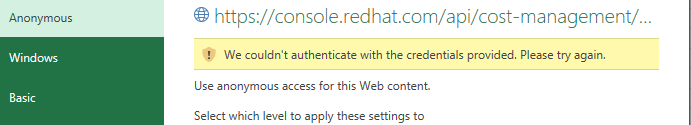

# Purpose
User Manual 

## Approach
1. Cost Management console data is extracted into Excel files. 
2. Power BI Report uses the excel files to visualize the data in the designed format. The Power BI desktop file can be published to Power BI Service for further distribution based on available access levels.

# Setup Environment
## Console Account Perquisites
1. The user should have access to Cost Management application using UI credentials. 
2. The user should have service accounts and asscoiated client credentials defined. Please refer the [link](https://source.redhat.com/groups/public/consoledot/consoledot_blog/hcc__service_accounts_with_rbac_support_as_an_alternative_to_basic_auth) for assistance to configure the service accounts (Step 1: Set Up Service Account(s)) and obtaining client credentials (Step 2: Obtain Service Account Credentials).

## Machine Perquisites
## Microsoft Excel
1. Ensure user has access to a Windows machine with Microsoft Excel 2016 or later installed. 
2. Ensure Excel has the "Data" ribbon with option "Queries & Connections" or "Show Queries" available underneath. If the options are not available, navigate to File, Options, Customize Ribbon to add the option. 
3. Navigate to Data --> Get Data --> Launch Power Quer Editor... (or Data --> From Table). This should open the Power Query window. On the left side of the screen, expand on "Queries". The confirms that Power Query is available.

**_Note: The navigation steps might differ depending on the Excel version being used. The goal is to ensure that data queries & conections are accessible and can be reviewed through Power Query if required._**

## Microsoft Power BI
1. Ensure user has the latest version of Power BI Desktop installed on the Windows machine. It can be downloaded from [Microsoft](https://www.microsoft.com/en-us/download/details.aspx?id=58494) site. 
2. Ensure Power BI Service is accessible if the report needs to be published to the service. The service can be accessed at https://app.powerbi.com/

## Test Execution
### Test Goal
1. Ensure cost management data for OpenShift Details tab is presented in the Power BI report accurately.

### Data Extraction into Excel
1. Download the Excel data files (.xlsx) into a folder on your machine. Note this folder path to be used in Power BI Desktop.
2. Rename the file "auth.csv.sample" to "**auth.csv**". Replace the text "CHANGE THIS TO CLIENT_ID" & "CHANGE THIS TO CLIENT_SECRET" with the the service account client id and client secret respectively. Ensure both the values are segreagated by a comma.

3. Navigate to **Data --> Queries & Connections** or **Data --> Show Queries**. This should list the queries on the right side of the window. 

4. Navigate to **Data --> Get Data --> Data Source Settings...** or **Data --> New Query --> Data Source Settings...**. This should open the settings window. Select the path of the auth.csv file and click on the button **Change Source**. Update the **File Path** with the path for the auth.csv. Repeat this step for every excel file downloaded.

**Note:The auth.csv file can be moved to other folders of choice but the file path should be updated in the Data source settings.**

5. Navigate to the Data Period sheet. Update the Start and End dates as needed ensuring the guidelines provided are followed. Date should be in the format mm/dd/yyyy. 
6. Click on Refresh All button in the Data tab. The data in all sheets should be refreshed. While the data is extracted, hint messages like "Retrieving  Data" or "Running background query" are displayed in the lower corners of the excel window. The data in all the sheets should start refreshing. The message should disappear after all the worksheets are refreshed.
   
   
7. If any messages like below pops up to select the access level, try to select the first one in the list and click on connect. 

8. In case of a authentication error like below, select the next one in the list and click on connect. Repeat the step till the authentication error is resolved.

9. If the refresh fails due to performance issues or if data is not loaded into any of the sheets, navigate to each data sheet and execute one of the following for the data to be loaded.
 
 a. Navigating to the ribbon **Data --> Arrow on Refresh All --> Refresh** 

  b. In the **Queries & Connections** or **Workbook Queries** on the right side of the window, click on the query with the same name as the excel sheet name where the data set being refreshed is.  Right click on the query name and click on **Refresh**.

 c. In the **Queries & Connections** or **Workbook Queries** on the right side of the window, click on the query with the same name as the excel sheet name where the data set being refreshed is.  Right click on the query name and click on **Load to**. A pop-up message as below should open. Click on **Load**.

8. Execute the steps 2-9 above for each excel file.   

### Power BI Desktop
1. Open the PBIX file provided using Power BI Desktop. 
2. Navigate to the Home ribbon and click the arrow on **Transform Data --> Data source settings**.
3. Click on Change Source and enter the folder path where all the excel files are loaded. Click on OK. Close the Data source settings window.
4. A message should pop up on the screen with "Apply changes" and "Discard changes". Click on "Apply changes". The data should get refreshed with the files in the data source mentioned.

5. Click on "Refresh" button in the Home ribbon. This should refresh the data in the pages.
6. To publish the report to Power BI Service after the refresh is completed, navigate to Home --> Publish, click on select after identifying appropriate workspace. A message that the report is published to service should pop-up.
7. Navigate to appropriate workspace on https://app.powerbi.com/ and click on the name of the report published. This should open the report. 

### Data Presentation

The Cost Management console pages will map to the below Power BI report pages.

| Console Page  | Tab | Power BI Page|
|:-----| :---------| :---------|
|  OpenShift   | OpenShift Details | OpenShift Details |
|  OpenShift   | Cost overview | Cost overview |
|  OpenShift   | Historical data  | Cost overview  |
