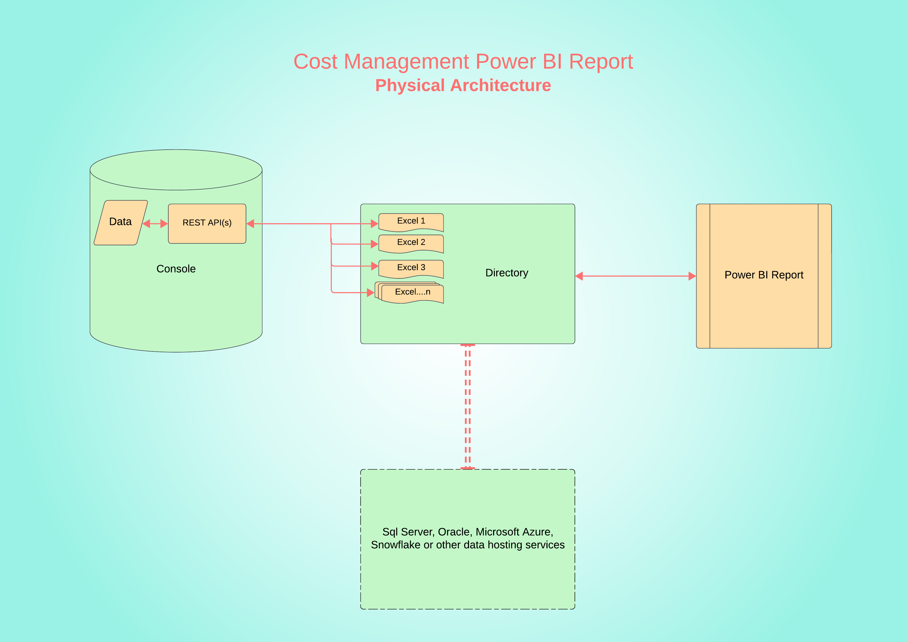

# Cost Management Power BI Charts 
# Technical Design Specification Document

## Introduction
The Technical design specification documents the system architecture for the Microsoft Power BI reports built for the Cost Management data. The document also covers the technical design technologies like Microsoft Excel involved in extracting the data from Cost Management and methods of extraction (REST APIs). 

## Definitions
| Term  | Definition |
|:-----| :---------|
|  MS   | Microsoft | 
|  BI   | Business Intelligence |
|  REST API   | Representational State Transfer Application Programming Interface |
|  RBAC   | Role-based access control |

## Architecture
1. Cost Management data is exposed through REST APIs for RBAC service accounts defined for the user accounts. 
2. Microsoft Excel (2016 or above) uses Power Query to extract data using the REST APIs.
3. Excel files with the extracted data will be loaded into a directory on a local machine or a cloud hosted service.
4. Microsoft Power BI Desktop connects to this folder to collect the data to present in different visualizations. 

### Physical Architecture

### Logical Architecture

## Assumptions and Dependencies
1. REST APIs will be available for MS Excel to connect and extract data.
2. Any changes to the REST API URL structure or response structure can impact the data processing in MS Excel or Power BI. 

## Detailed Design 

### Cost Management 
1. The following tabs in the Cost Management console will be presented in the Power BI Report.
	1. Overview
	2. OpenShift
	3. Amazon Web Services
	4. Google Cloud Platform
	5. Microsoft Azure
	6. Oracle Cloud Infrastructure
	7. Cost Explorer

2. The console user account used should have atleast one service account created. Service Accounts should have access to appropriate groups & roles to retrieve data from the APIs. Please refer to [document](https://access.redhat.com/documentation/en-us/cost_management_service/1-latest/html/limiting_access_to_cost_management_resources/index) for related groups & roles required.
3. Service token based authentication should be used to access the REST APIs. A REST API [call](https://sso.redhat.com/auth/realms/redhat-external/protocol/openid-connect/token) to retreive the service token should be executed prior to making a API call to get the cost data. The client credentials, available in the console, generated for the service account should be used as an authentication protocol.
4. The token received should be used as an authentication protocol for the REST API call to extract cost related data. The time limit for token is **5 minutes**.
5. Please refer to [document](https://source.redhat.com/groups/public/consoledot/consoledot_blog/hcc__service_accounts_with_rbac_support_as_an_alternative_to_basic_auth) on service account creation and RBAC.

### Microsoft Excel
1. Microsoft Excel should be version 2016 or later in order to use Power Query. 
2. Power Query is used to connect to REST APIs to extract the data from Cost Management, transform into the model required and load into the Excel Worksheets. 
3. Each Cost Management tab might need one more excel files to present the data. This is dependent on the number of REST APIs being called and the amount of data being extracted.
4. The client id and client secret used for authentication will be stored in a csv file named **auth.csv**. This file will be loaded as one of the data sources in each of the excel files. The authentication provided in the file will be used as part of the REST API call to get the service token.
5. Each Excel file will have a worksheet named "Date_Period" with Start and End Date fields. The dates entered in these fields will be used as a period for which the Power Query will request the data for from the REST APIs. The guidelines about the date values that need to be entered will be available in the Excel file template.
6. Multiple Excel files can be generated with different date ranges as long as Cost Management REST APIs are able to return the date for the given period.

#### Power Query Groups
 - The objects being built in Power Query will be segregated into **Groups** to put together entities with similar features. Below are the details related to groups.

| Group  | Entity Type |
|:-----| :---------|
|  Functions   | Power Query M functions |
|  Parameters   | Parameters |
|  Connections   | Placeholder queries that extract data using REST APIs or hard-coded values, for the output to be transformed and used in subsequent queries. The outcome of these queries are not loaded into worksheets.  |
|  Other Queries   | Final Queries that will have the output loaded into worksheets.  |

##### Functions
- The below functions will be used in Excel files across all tabs of the Console.

| Function Name  | Purpose |
|:-----| :---------|
|  get_token   | Calls the Token REST API and returns the service token using the authentication from the **auth** connection |
|  get_cost_loop_data   | Takes REST API filters as inputs, appends the default **limit** & **offset**, calls the **cost API** and records the data. This activity is looped for one or more times with incrementing offsets till all the data is retrieved. The final outcome of all API calls is returned as an output. |
|  replace_field_name   | Used to rename certain fields in a record by taking the record, field name to be replaced and new name as parameters. This is usually used in case of Tags or other group bys which have dynamic field naming convention in the API response to ensure all Tag Names have same column name despite of being related to different tags.    |
|  get_no_loop_data   | Used in case where no API paging exists and does not need to loop for different offsets. The function takes API filter as a parameter, calls the API and returns a response. |
|  get_usage_loop_data   | Takes REST API filters as inputs, appends the default **limit** & **offset**, calls the **Usage API** and records the data. This activity is looped for one or more times with incrementing offsets till all the data is retrieved. The final outcome of all API calls is returned as an output.|

##### Parameters
- The below parameters will be used in Excel files across all tabs of the Console.

| Parameter Name  | Purpose | Value |
|:-----| :---------| :---------|
|  Console_URL   | URL of the console that will be appended with other parts of the URL based on the REST API being called  | https://console.redhat.com |
|  Currency_URL   | REST API URL to get Currency master data   | /api/cost-management/v1/currency/?filter%5Blimit%5D=15&limit=100&offset=0 |
|  Costs_URL   | Part of the REST API URL for OpenShift costs  | /api/cost-management/v1/reports/openshift/costs/ |
|  Usage_URL   | Part of the REST API URL for OpenShift cost Usage (Compute, Memory & Volumes) | /api/cost-management/v1/reports/openshift/ | 
|  Tags_URL   | Part of the REST API URL for tags associated with OpenShift projects  | /api/cost-management/v1/tags/openshift/ |
|  Default_Configs_URL   | Part of the REST API URL to get default user configurations | /api/cost-management/v1/account-settings/ |
|  Opt_URL   | Part of the REST API URL for Optimizations  | /api/cost-management/v1/recommendations/openshift |
|  API_Limit   | Default limit when paging is used for REST API calls | 10 |
|  API_Offset   | Default offset value for the first API call when paging is used. Though the parameter always remains 0, the value is incremented in the function itself till all the data is extracted | 0 |

##### Connections

| Console Tab | Name  | Used for Group By  | Description | Sample API |
|:-----| :---------| :---------| :---------|  :---------|
|  Not Applicable   |  auth   | Not Applicable   | Client ID and Client Secret authentication  |  |
|  OpenShift   |  Currency_Master   | Not Applicable   | Currency master data | [Currency API](https://console.redhat.com/api/cost-management/v1/currency/?filter%5Blimit%5D=15&limit=100&offset=0) |
|  OpenShift   |  Default_Configurations   | Not Applicable   | Default user settings data | [Configurations API](https://console.redhat.com/api/cost-management/v1/account-settings/) |
|  OpenShift   |  Cost_Data_Project_Daily_Extract   | Project   | Projects REST API call and expand meta data | [OS Projects API](https://console.redhat.com/api/cost-management/v1/reports/openshift/costs/?currency=USD&filter[limit]=100&filter[offset]=0&filter[resolution]=daily&start_date=2024-01-01&end_date=2024-01-31&group_by[project]=*&order_by[cost]=desc) |
|  OpenShift   |  Cost_Data_Master_Projects_Daily   | Project   | Distinct projects extracted out of Cost_Data_Project_Daily_Extract  |  |
|  OpenShift   |  Cost_Data_Projects_Daily   | Project   | Projects and associated costs extracted out of Cost_Data_Projects_Daily_Dist_Cost |  |
|  OpenShift   |  Cost_Data_Clusters_Daily_Extract   | Cluster   | Clusters REST API call and expand meta data | [OS Clusters API](https://console.redhat.com/api/cost-management/v1/reports/openshift/costs/?currency=USD&filter[limit]=100&filter[offset]=0&filter[resolution]=daily&start_date=2024-01-01&end_date=2024-01-31&group_by[cluster]=*&order_by[cost]=desc) |
|  OpenShift   |  Cost_Data_Master_Clusters_Daily   | Cluster   | Distinct clusters extracted out of Cost_Data_Clusters_Daily_Extract  |  |
|  OpenShift   |  Cost_Data_Clusters_Daily   | Cluster   | Clusters and associated costs extracted out of Cost_Data_Master_Clusters_Daily |  |
|  OpenShift   |  Cost_Data_Nodes_Daily_Extract   | Node   | Nodes REST API call and expand meta data | [OS Nodes API](https://console.redhat.com/api/cost-management/v1/reports/openshift/costs/?currency=USD&filter[limit]=100&filter[offset]=0&filter[resolution]=daily&start_date=2024-01-01&end_date=2024-01-31&group_by[node]=*&order_by[cost]=desc) |
|  OpenShift   |  Cost_Data_Master_Nodes_Daily   | Node   | Distinct nodes extracted out of Cost_Data_Nodes_Daily_Extract  |  |
|  OpenShift   |  Cost_Data_Nodes_Daily   | Node   | Nodes and associated costs extracted out of Cost_Data_Master_Nodes_Daily |  |
|  OpenShift   |  Cost_Data_Tags_Daily_Extract   | Tag   | Tags REST API call and expand meta data. Tag keys are extracted into table **OS Tag Keys** and joined to this query prior to invoking the API  | [OS Tags & Keys API](https://console.redhat.com/api/cost-management/v1/reports/openshift/costs/?currency=USD&filter[limit]=100&filter[offset]=0&filter[resolution]=daily&start_date=2024-01-01&end_date=2024-01-31&group_by[tag:api]=*&order_by[cost]=desc) |
|  OpenShift   |  Cost_Data_Master_Tags_Daily   | Tag   | Distinct nodes extracted out of Cost_Data_Tags_Daily_Extract  |  |
|  OpenShift   |  Cost_Data_Tags_Daily   | Tag   | Tags and associated costs extracted out of Cost_Data_Master_Tags_Daily |  |
|  OpenShift   |  Usage   | Not Applicable   | Hardcoded table with different OS usage models |  |
|  OpenShift   |  Usage_Data_Daily_Extract   | Not Applicable   | Usage REST API Call for a combination of each Group By to each usage model | [OS Usage API](https://console.redhat.com/api/cost-management/v1/reports/openshift/memory/?filter[limit]=100&filter[offset]=0&filter[resolution]=daily&start_date=2024-01-01&end_date=2024-01-31&group_by[project]=*) |
|  OpenShift   |  Usage_Data_Projects_Daily   | Project   | Usage data for Projects extracted out of Usage_Data_Daily_Extract |  |
|  OpenShift   |  Usage_Data_Clusters_Daily   | Cluster   | Usage data for Clusters extracted out of Usage_Data_Daily_Extract |  |
|  OpenShift   |  Usage_Data_Nodes_Daily   | Node   | Usage data for Nodes extracted out of Usage_Data_Daily_Extract |  |
|  OpenShift   |  Usage_Data_Tags_Daily   | Tag   | Usage data for Tags extracted out of Usage_Data_Daily_Extract |  |
|  Optimizations   |  Recommendations_Extract   | Not Applicable   | Optimizatoins REST API call and expand meta data | [Optimizations API](https://console.redhat.com/api/cost-management/v1/recommendations/openshift?limit=100&offset=0&order_by=last_reported&order_how=desc) |
|  Optimizations   |  Recommendations_Base   | Not Applicable   | List of clusters, associated entities like containers and current configuration |  |
|  Optimizations   |  Recommendations_ST   | Not Applicable   | Short term recommendations/openshift |  |
|  Optimizations   |  Recommendations_MT   | Not Applicable   | Medium term recommendations/openshift |  |
|  Optimizations   |  Recommendations_LT   | Not Applicable   | Long term recommendations/openshift |  |

##### Other Queries

| Console Tab | Name  | Worksheet  | Description |
|:-----| :---------| :---------| :---------|  
|  OpenShift   |  Data_Period   | Data_Period   | Date range with in which the data needs to be extracted |
|  OpenShift   |  Default Master Settings   | Default Master Settings   | Default user currency description and cost types |
|  OpenShift   |  OpenShift Group Bys   | OpenShift Group Bys   | Hardcoded table with different group by models |
|  OpenShift   |  Project Overhead Cost Types  | Project Overhead Cost Types   | Hardcoded tables for overhead cost types (distributed vs non-distributed) |
|  OpenShift   |  OS Costs Daily   | OS Costs Daily   | Daily OpenShift costs for all group by models |
|  OpenShift   |  OS Cost Project Tags   |  OS Cost Project Tags  | Tags and keys associated with each OpenShift project |
|  OpenShift   |  OS Cost Cluster Projects   | OS Cost Cluster Projects   | Projects associated with each OpenShift cluster |
|  OpenShift   |  OS Tag Keys   | OS Tag Keys   | OpenShift Tag keys |
|  OpenShift   |  OS Daily Usage   | OS Daily Usage   | Daily OpenShift Usage for a combination of each group by and usage models |
|  Optimizations   |  Recommendations   | Recommendations   | Optimizations with all recommendations merged |  |

### Power BI
1. All Microsoft Excel files with the Cost Management data should be of file extension ".xlsx" and be placed in one directory or sub-directories under a root directory. The path of the root directory should be defined in the **Data Source Settings** of the Power BI Desktop (.pbix) file.
2. Power Query in the .pbix file should be used to collect the data from the Excel Worksheets. Though Power BI is able to access the data from the Excel Connections, it is recommended to use the Worksheets to avoid duplicate REST API calls. 
3. All data duplicates should filter out in the Power Query. Ex: Though Default Master Settings can exist in multiple Excel files, Power Query will process only distinct values.
4. Each Excel worksheet will be defined as a table in Power BI. Some worksheets will be merged with other tables. 
5. Tables marked as "No" for *Load Enabled* in the below table will not be loaded into Data model though those will be used in Power Query.

##### Query Tables

| Table Name | Excel Worksheet | Load Enabled | Description |
|:-----| :---------| :---------| :---------|  
|  Data Source   |     | No   | All Excel files with all worksheets and connections |
|  OpenShift Group Bys   |  OpenShift Group Bys   | No   | Hardcoded table with different group by models. This table will be merged with Cost Tags into a new query OpenShift_Groups_Tags |
|  Default Master Settings   |  Default Master Settings   | Yes   | Default user currency description and cost types |
|  Tag Dummy Table   |     |  No  | Hardcoded record for Tag with blank key. The record will be usefull as part of the filter mechanism when listing Tags in OpenShift details page |
|  Cost Tags   |  OS Tag Keys   | No   | OpenShift Tag keys |
|  Data_Period   |  Data_Period   | Yes   | Date range acquired across all Excel files |
|  OS Groups Tags   |  | Yes | Table generated by merging OpenShift Group Bys & Cost Tags to list all group bys and keys associated with tags |
|  OS Project Cost Types   |  Project Overhead Cost Types  | Yes   | Hardcoded tables for overhead cost types (distributed vs non-distributed) |
|  OS Daily Costs   |  OS Costs Daily   | Yes  | Daily OpenShift costs for all group by models |
|  OS Cost Project Clusters   |  OS Costs Daily   | Yes   | Clusters associated with each OpenShift project |
|  OS Cost Cluster Projects   |  OS Cost Cluster Projects   | Yes   | Projects associated with each OpenShift cluster |
|  OS Cost Project Tags   |  OS Cost Project Tags   | Yes   | Tags and keys associated with each OpenShift project |
|  OS Daily Usage   |  OS Daily Usage   | Yes  | Daily OpenShift Usage for a combination of each group by and usage models |
|  Optimizations   |  Optimizations   | Yes  | Recommendations OpenShift |

##### DAX Tables

| Table Name | Description |
|:-----| :---------| 
|  DateTable   |  Date range starting with minimum of Start Date and ending with maximum of End Date from Data_Period |
|  MonthTable   | Distinct Month & Year combinations from DateTable |
|  OS Monthly Costs  | Monthly aggregated columns from  OS Daily Costs |
|  OS Monthly Usage  | Monthly aggregated columns from  OS Daily Usage |

##### Visualization Pages

| Page Name | Description |
|:-----| :---------| 
|  OpenShift Details   | All OpenShift Group Bys with associated Names and costs |
|  Cost Overview   | Cluster and Tag/Keys associated with each Project; Projects associated with each Cluster; Usage (CPU, Memory & Volume) details; Running total of daily cost, usage details for selected and previous periods; |
|  Cost Explorer  | Daily Costs table for each group by; Bar chart visualization of 5 leading costs for each group by  |
|  Optimizations   |  OpenShift Optimizations |